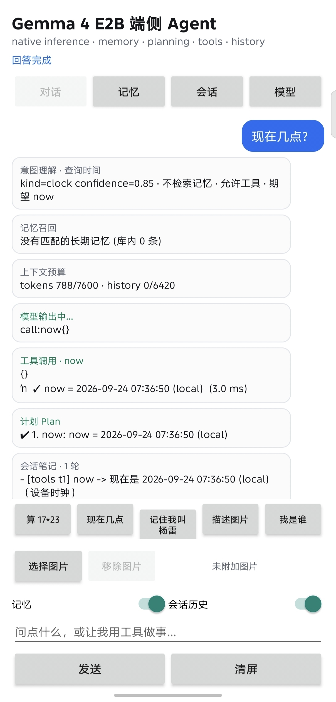

# Gemma 4 E2B 在 Dimensity 8400（MT6899）上：NPU 视觉 + CPU 文本

**中文** | [English](README.md)

`gemma-4-E2B-it` 在 MTK 8400 平台上的混合式端侧部署（`ro.soc.model=MT6899`，Dimensity 8400，Android 16，adb root）。

| 阶段 | 位置 | 方案 |
|---|---|---|
| Gemma 4 视觉塔（16 层，768 隐藏维） | MDLA NPU，两个 DLA | NeuroPilot 混合精度 W8A16（int8 权重、16-bit 激活、边界保持 FP），bf16 计算 |
| 3x3 空间池化（merger 的平均） | CPU | 精确 box average + sqrt(768)，见 `pool_patches()` |
| `embed_vision` 投影 | MDLA NPU（tail DLA） | W8A16 的 RMSNorm + Linear |
| Gemma 4 文本主干（35 层、PLE、KV sharing） | CPU（4 颗性能核） | MNN Q4，block 64，PLE int4 |
| Prompt、图像预处理、embedding 拼接 | CPU | C++ runner（`gemma4-d8400-runner`） |
| Agent：推理、记忆、规划、工具、历史 | CPU，与 runner 同进程 | `runtime/agent/` |
| UI | Android 应用 | `Gemma 4 D8400` |



*目标机截图（1208x2644）。模型、记忆库、工具和会话历史都在同一个 arm64 进程里，App 只渲染这个进程吐出的事件。*

真机上按出货的 480x624 画布端到端跑：视觉编码器（front DLA，patchify + 16 层，全部在 MDLA 上）耗时 0.51–0.61 s，CPU 3x3 池化与 tail DLA merger 再花约 5 ms，prefill 为 1.4–2.1 s，因此首个请求 TTFT 为 2.0–2.7 s。后续请求多一次 1.9 s 的 MNN 重建（见 trap T15）。decode 17.7–18.9 token/s，图像描述正确（对 HuggingFace 的余弦相似度 0.994–0.999）。

完整的复现手册（环境、架构决策、流水线、陷阱目录、验证数据、代码摘录）是 `helpers/docs/Gemma4-E2B-D8400-Hybrid-Deployment.docx`，由 `helpers/tools/make_reproduction_doc.py` 生成，任何一次重跑之后都可以重新出文档。

部署形态的只读参考：`/mnt/d/codes/Gallery/gitlab/phonevlm/mtk` 下的 MT6899 MiniCPM-V 4.6 交付，同一代 SoC、同一个 NeuroPilot 9.0.9 SDK。

## 为什么这样切分

视觉塔是固定形状、权重密集的卷积/注意力堆叠，正是 MDLA 配 int8 权重最擅长的形态，同时把约 150 M 参数的计算从 CPU 上移走。

文本主干一次只生成一个 token。每次 NPU 调用都要付一次图边界的代价，而 MiniCPM-V 在这个 SoC 上的实测显示 decode 会从约 62 token/s（MNN CPU）跌到约 2.6 token/s（逐层 NPU 图）。所以文本留在 MNN Q4 上。

## 端侧 Agent（原生实现）

runner 同时也是 agent。一个 arm64 进程持有模型、记忆库、规划器、工具和会话历史，App 只渲染这个进程吐出的事件。

```text
app  --write-->  agent/request.json
native           recall -> context -> plan -> (tool call -> observation)* -> answer
app  <--tail---  agent/events.jsonl   (steps, tool calls, memory writes, metrics)
```

| 职责 | 位置 | 说明 |
|---|---|---|
| 模型推理 | `runtime/gemma4_hybrid_runner.cpp` | NPU W8A16 视觉 + MNN Q4 文本。文本轮次通过 MNN 的 prompt cache 复用 KV，只预填充新增的那段 |
| 记忆 | `runtime/agent/agent_memory.cpp` | 有界磁盘存储（事实、偏好、笔记、episode 摘要），带 BM25、中文 bigram、时间/重要性衰减、近似重复合并、剪枝，以及按槽位更新："记住我叫李雷" 之后 "改成记住我叫杨雷" 会替换该记录，而不是两条并存 |
| 规划 | `runtime/agent/agent_planner.cpp` | 由 `make_plan`/`update_plan` 驱动的计划状态机。运行时还会记录隐式步骤，所以 UI 总能看到实际发生了什么 |
| 工具 | `runtime/agent/agent_tools.cpp` | 12 个原生工具（calculator、now、unit_convert、text_stats、remember、recall、forget、search_history、image_info、device_info、make_plan、update_plan），并为 2B 模型自创的工具名做别名解析 |
| 历史 | `runtime/agent/agent_session.cpp` | 每会话 append-only 记录、滚动摘要、压缩、会话列表/重命名/删除 |
| 协议 | `runtime/agent/agent_prompt.cpp` | checkpoint 自身的函数调用语法，见下 |

这些逻辑没有一行在 Java 里。App 写一个请求文档，然后画事件流。

### 模型用它自己原生的语法调用工具

`gemma-4-E2B-it` 的后训练就是围绕它 chat template 定义的函数调用语法，而出货的 Q4 导出会自发地产生这套语法：

```text
declaration  <|tool>declaration:calculator{description:<|"|>...<|"|>,parameters:{...}}<tool|>
model asks   <|tool_call>call:calculator{expression:<|"|>17*23<|"|>}<tool_call|>
tool answer  <|tool_response>response:calculator{ok:true,result:<|"|>17*23 = 391<|"|>}<tool_response|>
```

`helpers/tools/agent_live_probe.cpp`（x86 上跑真实权重）测过这段块能放在哪里。以 `<|tool_response>` 开头的用户轮次会让模型立刻结束本轮；把它放进模型轮次、紧跟 MNN 的 `<turn|>`\n`<|turn>model`\n 之前，会让模型重新吐出结束 token 然后停下。先用一行纯文本引出观测、再追加原生块，既能得到回答、又保持 MNN 的 prompt-cache 前缀有效，运行时采用的就是这种组合。

### 上下文预算

| 项目 | 默认值 | 说明 |
|---|---|---|
| KV cache（`max_all_tokens`） | 2048 | prompt + 生成 |
| 系统提示词 + 工具声明 | 677 token | 用真实 tokenizer 实测 |
| Prompt 预算 | 1700 | 单次生成的硬上限 |
| 历史预算 | 推导（603） | prompt 预算 − 系统提示词 − 一轮的额度 |
| 答案预留 | 320 | `max_answer_tokens` |

文本轮次走 prompt-cache 增量路径，每轮预填充约 20–160 token，而不是约 900。任何改变会话的动作（新建会话、一次压缩、一个图像轮次）都会先重建 MNN 引擎，因为 `Llm::reset()` 无法完全清空 Gemma 4 的混合滑窗 KV cache（trap T15）。

### 出货版 Q4 导出的真实边界

* 工具调用和多轮循环是通的，但模型无法可靠地复述 token 序列：让它重复 `5927452215`，它答 `51937423`；`ZQ7-4412` 会变成 `ZQ3-4412`，而且这些都没走工具。因此工具应当返回模型能简单复述的值，同时 App 把每个观测结果单独渲染成卡片，让用户看到确切结果。
* 工具名字会漂移（`get_time`、`current_time`、`calc`、单字母笔误）。注册表在报错之前会先解析别名和单字符偏差。
* 一条确定性的路由提示（算术、时间、图像、"记住"、"召回"）追加在用户消息上，绝不放进系统提示词，因为系统提示词必须逐字节一致，prompt cache 才能命中。
* 取消一个轮次会立即停止流式输出，但正在跑的 decode 步骤会先结束：这份交付链接的 arm64 MNN 运行时没有导出 `setTokenCallback()`，所以单步的时长由 `max_tokens_per_step` 兜住。

### 真机部署与实测（2026-09-21）

| 指标 | 数值 |
|---|---|
| NPU 视觉精度（step 9，启用 agent 的 runner） | 余弦 0.998，117 token，592 ms |
| Agent 服务启动 | 3.32 s（其中 LLM 加载 2.88 s） |
| 新会话首轮（全量 prefill） | TTFT 15.4–17.3 s（约 900–1000 prompt token） |
| 后续文本轮（复用 KV） | 增量 82–153 token，TTFT 约 1–3 s |
| Decode | 16.1–16.6 token/s |
| 工具执行 | calculator 执行了用户的表达式：`17*23 = 391` |
| 图像轮次 | dog 测试图 + "describe this image in detail" → "I can see a dog in the image." |

真机暴露出四件 x86 探针测不到的事，都已在原生代码里修掉：Q4 导出在设备上会写出畸形的工具调用（`call:calculator::calculator{...}`、参数表丢失、多余的 `<|"|>` 尾巴），所以工具名按标识符解析、别名和笔误会被解析、路由提示现在会把算术和时钟问题的确切调用拼出来并在模型丢参数时有确定性兜底；模型自己的答案文本在数字上不可信，以工具卡片为准；thinking 通道会以纯文本泄漏，现在按 checkpoint 模板的方式剥离；空生成会重试一次，而不是用 "I could not produce an answer" 结束本轮。

### 意图路由

每个轮次先做分类，用 `runtime/agent/agent_intent.cpp` 里的原生模式匹配，不调用模型。得到的策略决定后续一切：是否查询长期记忆、是否预期工具调用、答案是否必须保持纯文本。问候语不触碰记忆库；算术或时钟问题由路由直接给出确切的调用；记忆类问题直接由存储回答、不调工具；图像描述禁止工具（`image_info{data:...}` 那类尝试正是这样被拦下的）。判定结果以 `intent` 事件发出，并在聊天里显示成一张卡片。对图像描述，如果答案拒绝作答、把问题反弹回来或过短，会回退到出货的单轮 prompt（"Describe this image."）。

### 附件是一次性的

附件只作用于随它一起发出的那条消息。本轮发出后，芯片回到 未附加图片，清屏 也会把它卸下，另外有 移除图片 按钮可按需解除。关于这张图的后续提问仍然能通过会话记录解析，因为图像轮次保留了自己的缓存画布。

### 工具失败升级与部署建议

同一个工具以同样方式失败两次后，会提示模型改变策略而不是重试一模一样的调用（Mobile-Agent-E 的 `err_to_manager_thresh`）。`agent-config.json` 还能把部署建议（`system_tips`，例如 "Answer in the user's language"）钉进系统提示词，渲染为 `DEPLOYMENT NOTES (always apply)` 区块。

### 问候语与残留上下文

问候语有自己独立的意图（`greeting`）：不查记忆、不调工具、纯文本。真机上，图像轮次之后来一句 "Nihao" 曾经被答成 "I didn't understand what you want me to do with the image"，因为上一轮的图像还在会话上下文里，小模型就抓住了它。现在，提到图像的问候语答案会被拒绝一次并重新要求给出纯问候；真机实测该轮以 "Hello! How can I assist you today?" 结束。上一张图仍然有意保留在会话记录里，因此关于它的追问能通过缓存画布解析。

### 图像轮次

图像轮次每一步都走同一条路径。运行时每次调用都把图像描述交给 driver；driver 只在自身 KV 状态是新 prompt 前缀时才走增量 prefill，否则重跑视觉塔并做全量 prefill。图像提示词要求给出纯文本描述，并且有意不提 `image_info`，否则 Q4 导出会试图把图像字节交给这个工具。无法解析的工具形状答案会触发一次纯文本重试。

对图像做开放式建议（"how to make this image better"）仍然超出这个导出的能力，所以 UI 为实际验证过的路径提供了 描述图片 快捷按钮。

### 验证

```bash
helpers/tools/build_agent_host_tests.sh     # 417 checks, stub model, no device needed
helpers/tools/run_agent_live_probe.sh       # real Q4 weights on x86: protocol, prompt cache, KV, reset
./helpers/scripts/12_reproduce_all.sh       # steps 1-12 include both
```

主机套件覆盖 JSON 编解码、calculator、每个工具、记忆库、会话/记录存储、规划器、协议解析、完整轮次循环（工具错误、预算、强制作答）、图像轮次、压缩、会话、事件契约，以及面向 App 的文件协议（请求进、事件出、响应文档、取消哨兵、旧版 benchmark 触发、畸形输入）。live probe 用设备同样的 MNN 调用跑导出权重：连续三轮共用一个引擎、首轮之后零重载（`full_prefills=0 delta_generations=5 engine_resets=0`），calculator 往返完成，重复 `reset()` + 重新 prefill 产出完全一致的输出。

## 记忆系统

三层结构，各有各的生命周期：会话记录（说过的每一句，随会话删除）、滚动会话摘要、跨会话存储。只有最后一层是 UI 意义上的记忆。它在 `runtime/agent/agent_memory.{h,cpp}` 里是纯文件存储，所以数据能扛过 App 更新，也能直接用 `cat` 读：

```text
<agent_dir>/memory/memories.jsonl   one JSON record per line
<agent_dir>/memory/state.json       { sequence, updated_ms, records }
```

| 字段 | 含义 |
|---|---|
| `id`、`text`、`kind` | `m<N>`、存储的句子，以及 `fact` / `preference` / `note` / `episode` |
| `importance`、`pinned` | 检索与剪枝用的 0–1 权重；pinned 记录永不剪枝、始终注入 |
| `created_ms`、`updated_ms`、`last_access_ms`、`access_count` | 时间与频次信号 |
| `session`、`turn`、`tags` | 溯源信息，能把一条记录追到写入它的那个轮次 |

写入。`AgentRuntime::write_memories()` 在每一轮之后运行。规则抽取器（`agent_prompt.cpp` 里的 `extract_memories()`）把显式的 "记住…" / "remember …" 变成 `fact`（importance 0.9），把身份陈述（"我叫…"、"我住在…"、"call me …"）变成 `fact`（0.8），把偏好（"我喜欢…"、"i prefer …"）变成 `preference`（0.7）。祈使前缀会被剥掉，所以库里存的是 "我叫杨雷" 而不是 "记住: 我叫杨雷"。修正标记（"改成"、"改为"、"instead"）会把文本裁到修正后的部分并给记录打标，于是它替换掉旧值而不是再加一条。其余内容记为 `episode`（"Q: … -> A: …"，importance 0.3），除非打开 `store_episodes`，否则会被丢弃：轮次 episode 属于会话记录，通过 `search_history` 找。每次写入都发出 `memory_write`，带 id、kind，以及这条记录是 `new`、`merged` 还是 `updated`。`GEMMA4_AGENT_MODEL_MEMORY=1` 会加一次小模型调用、可以取代规则输出；默认关闭，因为出货的 Q4 导出是在规则输出上验证的。

去重。`MemoryStore::add()` 按顺序试三条规则，命中第一条就停：

1. 槽位冲突：`extract_slot()` 把开头模式映射为 key（`name`、`city`、`job`、`preference`）。同 kind、同 key 下出现不同的值就替换旧记录，所以 "记住我叫李雷" 接 "改成记住我叫杨雷" 之后只剩一条。
2. 显式修正：带 `correction` 标记的记录，在 token Jaccard 相似度到 0.2 时就替换同 kind 里最相似的那条，即使措辞变化很大也成立。
3. 近似重复：Jaccard >= 0.72 时并入已有记录（取更长的文本、合并 tag、抬高 importance、增加访问计数）。

检索。`MemoryStore::search()` 是对 `tokenize()` 产出的 token 做本地 BM25（k1 = 1.2，b = 0.6）。ASCII 词小写化；中文则每个码点加每个 bigram，所以 "手机" 也能匹配 "我手机壳是紫色的"。词法分数会乘上 kind 权重（episode 0.55、fact/preference 1.0、note 0.9）、乘上 `0.6 + 0.8 * importance`、乘上时间因子 `0.7 + 0.3 * 0.5^(age / half_life)`（半衰期 14 天），常用记录再乘 `1 + 0.05 * min(access_count, 8)`，完全短语匹配有 1.5 的加成，pinned 则乘 `1 + 0.5 * importance`。低于 `memory_min_score`（0.12）的直接丢弃，所以一句问候什么都不会召回到。

`AgentRuntime::recall()` 在这个基础上再包一层。`"memory": false` 时它什么都不返回；本次会话命中的结果乘 1.6，这样这场对话刚刚建立的事实能压过更早会话对同一问题的答案；pinned 记录始终追加；列表上限是 `recall_top_k`（4）+ 4。结果被前置到当前用户消息上，而不是插成单独一条消息，因为 prompt 中间多一条消息会让 KV 前缀失效：

```text
[MEMORY] earlier sessions may have stored this about the user. Use it only when it answers the current message; ignore it otherwise:
- (preference m7) 我喜欢紫色
[END MEMORY]
```

这段措辞是有讲究的：看起来像答案的召回内容就会被当成答案用，所以这段块明确写了它只是上下文。措辞松一点的时候，真机上它曾用记住的最爱颜色去回答关于一张图的 "它是什么颜色的？"。

生命周期。记录数超过 `memory_max_records`（500）时，`prune()` 按 `2 * importance + recency + 0.1 * min(access_count, 8)` 排序（episode 计 0.6）并丢弃尾部；pinned 记录无论如何都保留。`clear(kind, keep_pinned)` 和 `remove(id)` 支撑 UI 的"清空全部记忆"和单条删除；`remember` / `recall` / `forget` 三个工具（带别名解析，应对 2B 模型自创的名字）让模型在轮次内操作同一个库。写入时单条文本会被截断到 3 × `max_memory_chars` 字节。

## 会话历史与上下文管理

`runtime/agent/agent_session.{h,cpp}` 负责记录。`agent_runtime.cpp` 里的 `render_history()`、`compact_history()` 和 `update_session_notes()` 负责决定模型实际看到什么的策略。

```text
<agent_dir>/sessions/index.json         sequence + one meta per session, newest first
<agent_dir>/sessions/<id>/meta.json     title, timestamps, turns, compactions, summary, notes
<agent_dir>/sessions/<id>/turns.jsonl   append-only, one JSON object per completed turn
<agent_dir>/sessions/<id>/images/       the cached canvases of the image turns
```

一条轮次记录存下模型当时看到的原始 `messages`（用户、工具调用、观测等），同时带上该轮的耗时与用量（`ttft_ms`、`prefill_ms`、`npu_ms`、`decode_tps`、`prompt_tokens`），App 显示的数字就来自这里。

进 prompt 的东西。`render_history()` 组装系统提示词、滚动摘要（如果有）、`summary_upto` 之后的每一轮，以及本轮自己的往返。图像只在承载它的那一轮贡献 NPU 软 token。更早的图像轮次渲染成 `<|image>...<image|>` 被替换为 `[image: <note>]`，note 是模型对这张图说过的话加上 `; described as: ...`，这个替换会被持久化。于是后续 prompt 带的是一段文本描述，而不是 130 个软 token，也永不重跑视觉塔（`reuse_history_images` 可以有意把软 token 钉回来）。保留轮次里的工具调用与观测保持原样，只有压缩会折叠它们。

压缩。当会话记录不再装得下历史预算，或者组装出的 prompt 超过 `context_budget_tokens`，`compact_history()` 会请求模型为最旧的若干轮生成摘要（一次辅助调用，≤ 220 token，并把已有摘要作为 `EXISTING SUMMARY` 一起喂进去），把结果写进会话 meta 的 `summary` 与 `summary_upto`，`compactions` 计数 +1，发出 `context_compacted`，并在下一步强制全量 prefill。最新的 `recent_turns_min`（2）轮永远不会被摘要；一次压缩也不会少于 `compaction_min_turns`（4）轮：早先的版本每条消息都折叠一轮，28 轮里产生了 17 次压缩，而每次都要付一次摘要生成加一次引擎重建。

预算。`history_budget_tokens()` 从 prompt 预算推导记录预算：`context_budget_tokens`（1700）减去实测的系统提示词及其工具声明（677），再减去一轮自身的 420 token 额度，下限 128，得到 603。在 `agent-config.json` 中设置 `history_budget_tokens` 改为钉死一个显式值。`"history": false` 切换到全新上下文模式：只有系统提示词、当前消息和本轮的往返。

会话笔记（Notetaker）。`update_session_notes()` 为每个"留下了东西"的轮次追加一条有界 bullet：`[image t7] <这张图看到了什么>`、`[memory t7] <存了什么>`、`[tools t7] calculator, now -> <答案开头>`。只保留最后 `session_notes_lines`（8）行、`session_notes_chars`（900）个字符，存在会话 meta 里，因此重启后仍在。它被注入到当前用户消息里（`[SESSION NOTES] earlier in this conversation: ...`）而不是放在历史之前，并且会在运行时可自行作答的轮次（算术、时钟、单位换算、字数统计）上被抑制：带着笔记时某个算术轮次什么都没答出来，去掉之后同一轮答对了 `42+16 = 58`。它也是让旧图在软 token 离开窗口后仍然可用的原因。

会话与控制。`create()` / `open()` / `rename()` / `remove()` 都通过 `index.json` 工作；当它丢失时会扫描会话目录重建，因此索引损坏不会让历史消失。新会话的标题取第一条用户文本（上限 `session_title_chars`），最多保留 `max_sessions`（40）个会话，最旧的连同目录一起删除。App 通过 `request.json` 驱动这一切（`new_session`、`open_session`、`delete_session`、`rename_session`、`list_sessions`、`history`、`compact`、`reset`），并镜像事件流（`turn_start`、`context`、`context_compacted`、`session_notes`、`answer`、`turn_end`）。会话页的"删除全部会话"只需一次点击加一次确认。

这套形态来自 Mobile-Agent 系列的两级窗口，但出货运行时用"一张图只活在它自己的轮次"加压缩来实现它。`image_window_turns`、`tool_detail_window_turns`、`recent_turns_max` 和 `max_context_turns` 仍会被解析并由 `capabilities` 上报，但真正驱动策略的只有 `recent_turns_min`、`compaction_min_turns` 以及笔记的几条上限。

## 视觉图

`helpers/src/gemma4_vision.py` 从 checkpoint 重建 `Gemma4VisionModel`，拆成两个静态 ONNX 分片：

```
front : canvas  float32 [1, 4, 720, 864]   (RGBA letterbox, alpha = padding)
             -> patch states float32 [1, 1, 2430, 768]
tail  : pooled  float32 [1, 1, 270, 768]   (3x3 average on the CPU, pre-scaled)
             -> soft tokens  float32 [1, 1, 270, 1536]
```

所有几何量都作为常量烘进图里：学习到的 patch 位置嵌入、2D（x/y）旋转嵌入，以及 3x3 空间池化矩阵。第一个算子是 stride-16 卷积，它选出每个 patch 的 768 个像素通道，并在最后一个输出通道里读取 alpha 平面的覆盖度；加性注意力掩码就是这个覆盖度乘以 `-30000`。把掩码留在卷积内部是刻意的：对输入张量做跨步切片会被调度到 MVPU，而它的编译器需要 OpenCL host；把第二个张量跨 `EDPA → MDLA` 边界传递又会逼 NeuroPilot 插入 bridge。两者都会让 `--disallow-bridge` 失败。

还有两条约束来自硬件而不是模型：

* bf16 计算（`--cast-fp32=bf16`）：视觉激活值可达约 2100，为 RMSNorm 平方它们会让 fp16 溢出。
* 分片：包含池化 MatMul 的图能编译，但会让 MDLA 返回全零输出，因此平均放到 CPU 上，tail DLA 只保留 RMSNorm + 投影。

runner 把保持长宽比的缩放结果 letterbox 到 864x720 画布左上角、为 padding patch 填好 alpha 平面、并丢掉只覆盖 padding 的池化 bin，从而精确复现 HuggingFace 的流水线：

```text
torch vs HuggingFace : cosine 1.000000 (MAE 1e-6) across dog/cat/document/qrcode
ONNX  vs torch       : cosine 0.9999999
```

`helpers/src/sanitize_onnx.py` 会把 `torch.onnx.export` 为 `chunk()`/`view()` 生成的形状管路常量折叠掉。MDLA 无法执行 `Shape`、`Gather` 或动态 `Reshape`，而 NeuroPilot 是以 `--disallow-bridge` 调用的，所以一次成功的构建里不含任何 CPU/OpenCL 回退。

### 画布 profile（几何是构建期决策）

因为所有依赖几何的张量都被烘进图里，换画布就意味着换一对 DLA、换 runner、换 APK：

| profile | patch 网格 | 画布 | 最大软 token | front DLA |
|---|---|---|---:|---:|
| 默认 | 54x45 | 864x720 | 270 | ~2.2 s |
| 出货 | 30x39 | 480x624 | 130 | 0.57 s |
| 备选 | 36x36 | 576x576 | 144 | 0.51 s |

```bash
./helpers/scripts/11_switch_canvas.sh 30 39     # rebuild everything into out-30x39/
./helpers/scripts/09_deploy_device.sh           # NPU accuracy check (cosine vs HuggingFace)
./helpers/scripts/10_run_demo.sh                # install the matching APK
```

`env.sh` 从 `GEMMA4_GRID_W/GEMMA4_GRID_H` 推导出 `GEMMA4_CANVAS_W/H`、软 token 预算和输出目录（`out-<W>x<H>/`）；`out/mnn/` 下的文本主干因为与画布无关而被共用。APK 通过 `-PgridColumns/-PgridRows` 拿到同样的数字，并在头部打印出来（`480x624 fit + padding, W8A16 vision`），所以编译进 DLA 的几何与 App 写出的 letterbox 一旦不一致就能一眼看出来；runner 会拒绝头部与自己几何不符的画布。

小画布不是没有代价：横幅输入（文档、二维码）丢掉的 token 最多，模型可能就"看不见"它们了。测量数据和这一比较在 PC 侧的细节见 `helpers/STATUS.md`。

## 构建流水线

两个包装脚本把下面的步骤串起来：

```bash
./helpers/scripts/00_clean_generated.sh --dry-run   # list what the pipeline produced (46 GB today)
./helpers/scripts/00_clean_generated.sh --yes       # delete it; docs, tools and inputs survive
./helpers/scripts/12_reproduce_all.sh               # raw checkpoint -> APK on the phone
./helpers/scripts/12_reproduce_all.sh --check-only  # preflight only: model, SDK, python, device
```

`12_reproduce_all.sh` 默认走出货的 30x39 profile（`out-30x39/`），先检查全部前置条件，再跑步骤 1–12（主机 agent 测试套件、arm64 runner、APK、x86 live agent probe）以及手工重生成，最后做一致性检查（DLA/TFLite/MNN/APK 齐全、组装权重与导出逐字节一致，trap T16）。`--grid 54 45` 用最初的 profile，`--from N` 续跑，`--no-device` 停在 APK，`--force` 忽略已有产物。如果 `$OUT` 里已经有另一个画布的图，它会拒绝启动，因为步骤 01 会静默复用它。全部输出 tee 到 `logs/reproduce-<timestamp>.log`。

重新构建的 APK 可能在 `:app:packageDebug` 撞上 AGP 的 `integer overflow`：增量打包器按 32 位算大小，而 APK 有 2.9 GB。步骤 8 会识别这条消息并在 `:app:clean`（非增量打包）之后重试，所以重跑不需要手工清理。

`00_clean_generated.sh` 只删流水线自己生成的东西（`out*/`、`logs/`、`work/`、Gradle 构建目录、`__pycache__`），文档、工具和所有输入都不动。它会带大小打印计划，除非给 `--yes` 否则先问一遍；`--device` 还会清理手机。

| 步骤 | 脚本 | 产物 |
|---|---|---|
| 1 | `helpers/01_export_vision.sh` | `out/vision/front` + `out/vision/tail`（`visual.static.onnx`、PyTorch fixture） |
| 2 | `helpers/02_prepare_vision_w8a16.sh` | W8A16 精度提示 + 48 个校准样本（来自 `/mnt/d/datas/simpletestsets`） |
| 3 | `helpers/03_convert_vision.sh` | 两个分片的 `.../visual_w8a16.tflite`（mtk_converter 9.12） |
| 4 | `helpers/04_compile_vision.sh` | `visual_front_w8a16_mt6899.dla` + `visual_tail_w8a16_mt6899.dla`（`--cast-fp32=bf16 --disallow-bridge`） |
| 5 | `helpers/05_export_mnn.sh` | `out/mnn/llm.mnn[.weight]`、`ple_embeddings_int4.bin`、`tokenizer.mtok` |
| 6 | `helpers/tools/run_agent_host_tests.sh` | 在主机上构建并运行原生 agent 套件（`work/agent-tests/`） |
| 6 | `helpers/scripts/06_build_runner.sh` | `out/runner/gemma4-d8400-runner`（arm64，视觉 + 文本 + agent） |
| 7 | `helpers/scripts/07_assemble_assets.sh` | `out/runtime-assets/runtime/**`，为打 APK 做准备 |
| 8 | `helpers/scripts/08_build_apk.sh` | `out/apk/gemma4-d8400-w8a16-q4-debug.apk` |
| 9 | `helpers/scripts/09_deploy_device.sh` | 推送两个 DLA 并运行设备端视觉检查 |
| 10 | `helpers/scripts/10_run_demo.sh` | 安装 APK、重标运行时目录、启动 bridge、拉起 App |
| 11 | `helpers/scripts/11_switch_canvas.sh W H` | 为另一个画布 profile 重建步骤 1–4、6–8（`out-<W>x<H>/`） |
| 12 | `helpers/tools/run_agent_live_probe.sh` | 在 x86 上把导出的 Q4 权重跑过 agent（工具协议、prompt cache、KV、reset） |

先 `source env.sh`；它钉住两个 Python 环境（导出用 `d7400export`，`mtk_converter` 用 `mtkcvt`）、NeuroPilot SDK、NDK，以及复制在 `3rd/` 下的配套二进制。

## 运行时契约

agent 服务是一个常驻进程，聊天 UI 与旧版单轮 demo 路径共用它：

```text
gemma4-d8400-runner --agent-service CONFIG VISION_DLA RUNTIME_ROOT AGENT_DIR [MAX_TOKENS]
gemma4-d8400-runner npu CONFIG VISION_DLA CANVAS_BIN REFERENCE_BIN
gemma4-d8400-runner --service CONFIG VISION_DLA CANVAS PROMPT REQUEST STOP LOG READY
```

| 文件（位于 `RUNTIME_ROOT/agent/`） | 方向 | 内容 |
|---|---|---|
| `request.json` | app -> native | `{"type":"turn","text":"...","image":"app-input-fp32.bin"}`，以及 `new_session`、`open_session`、`delete_session`、`rename_session`、`list_sessions`、`history`、`list_memories`、`delete_memory`、`clear_memories`、`remember`、`compact`、`capabilities`、`reset`、`cancel` |
| `events.jsonl` | native -> app | append-only JSONL：`hello`、`turn_start`、`recall`、`image`、`context`、`plan`、`step_start`、`step_delta`（base64 UTF-8）、`step_end`、`tool_call`、`tool_result`、`tool_alias`、`memory_write`、`context_compacted`、`answer`、`metrics`、`turn_end`、`error` |
| `response.json` | native -> app | 查询类请求的回复（历史、列表、capabilities） |
| `cancel` | app -> native | 停止当前轮次流式输出的哨兵文件 |
| `service-ready` | native -> app | DLA 与 LLM 都加载完成后写入一次 |

旧路径保持逐字节兼容：App 写入 `app-input-fp32.bin`（letterbox 后的画布，RGB 平面在 [0, 1]）、`app-prompt.txt` 和 `app-request`，同一个进程回以流式 token 日志加上 `RESULT` 指标，供亮屏/熄屏 benchmark 解析。

## 仓库结构

demo 本体是 `android/` 加 `runtime/`（App 驱动的那个 arm64 进程）以及 `helpers/scripts/`，也就是构建、组装、部署并运行它的那些步骤。只负责准备输入或做测量的内容都放在 `helpers/` 下。

| 路径 | 内容 |
|---|---|
| `android/` | Gradle demo 工程（Java，没有原生构建步骤） |
| `runtime/` | `gemma4_hybrid_runner.cpp` 与 `runtime/agent/`，由 `helpers/scripts/06_build_runner.sh` 编译 |
| `3rd/` | 内置的 MNN fork、主机端 `MNNConvert`、arm64 `libMNN.so`、NeuroPilot 设备端库 |
| `env.sh`、`agent-config.json` | 共享环境（`MTKG`、`OUT*`、`LOGS`、工具链路径）与 agent 运行配置 |
| `helpers/scripts/` | `00_clean_generated.sh` 与 `06`–`12`：编译 runner、组装素材、打 APK、部署、运行 demo、切换画布、一键复现 |
| `helpers/STATUS.md`、`helpers/01`–`05`、`helpers/src`、`helpers/tools`、`helpers/tests`、`helpers/inputs`、`helpers/docs`、`helpers/profiles`、`helpers/minicpmv46` | 测量与分析报告、checkpoint → DLA/MNN 转换、主机探针与评测套件、校准图像、手册，以及 MiniCPM-V 参考 demo 遗留的脚本 |
| `docs/images/` | 本 README 引用的截图 |

那半边的细节见 `helpers/README.md`。生成产物无论由哪个步骤产生，都留在根目录（`out/`、`out-<W>x<H>/`、`logs/`、`work/`）。

## `3rd/` 下的第三方输入

| 路径 | 来源 |
|---|---|
| `mnn-src/` | phonevlm 的 MNN fork（`gemma4` 导出器 + PLE 运行时），来自 MiniCPM-V 参考工程 |
| `mnn-host/` | 主机端 `MNNConvert`（只被 Python 导出步骤使用） |
| `mnn-android/libMNN.so` | 带 LLM 支持的 arm64 MNN 运行时 |
| `neuron/runtime/` | `mt6899` 的 NeuroPilot 9.0.9 设备端库 |
